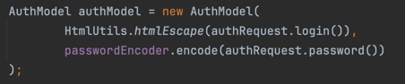
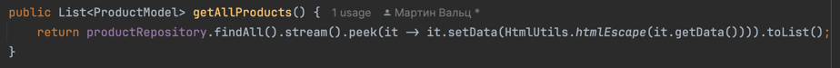
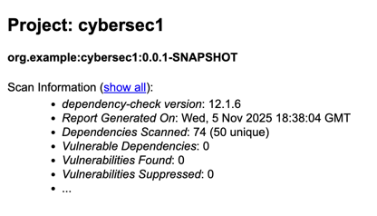
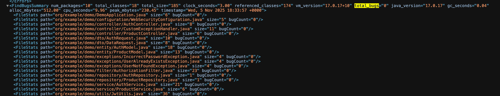

**Стек**
Java/Spring, Hibernate, PostgeSQL

**Описание API**

`POST /auth/register` - метод для регистрации пользователя (принимает логин и пароль).

```json
{
    "login": "exampleUser",  
    "password": "examplePassword123"
}
```

`POST /auth/login` - метод для аутентификации пользователя (принимает логин и пароль).

```json
{
    "login": "john.doe",  
    "password": "securePass123"
}
```

GET /api/data - метод для получения данных. Доступ только у аутентифицированных пользователей.

От SQLi код защищен с помощью Hibernate.

От XSS защищен с помощью экранирования пользовательских данных




**Отчеты из pipeline**

DEPENDENCY-CHECK



SPOTBUGS


